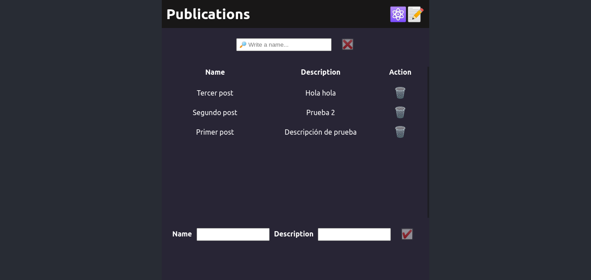

# Publications CRUD App ⚛️📝

This project was built with [ReactJS](https://github.com/facebook/create-react-app), [NodeJS](https://nodejs.org/es/), [PostgreSQL](https://www.postgresql.org) and [Docker](https://www.docker.com)

### ⚙️ Settings

This project uses the following settings for the database setup:

🔹 **Name:** development
🔹 **User:** miyuki
🔹 **Password:** qwe456
🔹 **Host:** localhost
🔹 **Port:** 2345 🔹

### 📌 Available Scripts

In the project directory, you can:

1. Run the app, the server and the database in development mode: `sudo docker-compose up`
> Open [http://localhost:3000](http://localhost:3000) to view it in the browser.
2. Tears down the docker containers: `sudo docker-compose down`

### ✨ Main View✨
Here is an example of what the app looks like when it runs.

